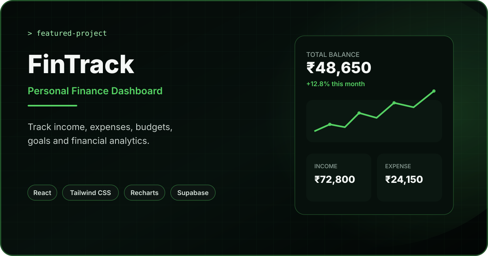

<div align="center">



<br/>

# FinTrack

### Personal Finance Management Dashboard

A modern React finance application for managing transactions, budgets, savings goals, debt and financial analytics through a responsive dashboard.

[](https://fintrack-devjit.vercel.app/)
[](https://react.dev/)
[](https://supabase.com/)

</div>

---

## Overview

**FinTrack** is a personal finance dashboard built to demonstrate practical frontend application development beyond a static UI.

The application combines a reusable React component architecture with authenticated user flows, protected routes, a Supabase-backed data layer, financial charts and responsive dashboard experiences.

Users can manage day-to-day financial records, organize budgets, track savings goals, review analytics and maintain their own profile from one application.

---

## Live Application

**Production:** https://fintrack-devjit.vercel.app/

> The live application is deployed on Vercel.

---

## Core Features

### Financial Dashboard

- Overview of financial activity
- Income and expense summaries
- Visual financial indicators
- Responsive dashboard layout

### Transactions

- Create income and expense records
- Edit existing transactions
- Delete transactions
- Organize records by category
- Add dates and notes
- User-specific transaction data

### Budgets

- Create category-based budgets
- Update budget limits
- Delete budgets
- Persist budget data per authenticated user

### Financial Goals

- Create savings goals
- Set target and saved amounts
- Add optional deadlines
- Track active and completed goals
- Update and delete goals

### Analytics

- Dedicated analytics area
- Financial data visualization with Recharts
- Reusable chart-driven UI
- Error-boundary protected analytics route

### Debt Center

- Dedicated debt-management section
- Structured debt-related financial workflow

### Authentication & Profile

- Login and registration flows
- Public-only authentication routes
- Protected application routes
- Persistent Supabase sessions
- User profile management

### UI & Experience

- Responsive desktop and mobile layouts
- Light / dark theme support
- Motion and interaction effects
- Toast notifications
- Form validation
- Reusable component system

---

## Tech Stack

| Area | Technology |
|---|---|
| Frontend | React 19, JavaScript ES6+ |
| Styling | Tailwind CSS, CSS |
| Routing | React Router DOM |
| Backend / Data | Supabase |
| Charts | Recharts |
| Forms | React Hook Form, Zod |
| Animation | Framer Motion |
| Dates | date-fns |
| UI Icons | Lucide React, React Icons |
| Notifications | React Hot Toast |
| Build Tool | Vite |
| Deployment | Vercel |
| Performance | Vercel Speed Insights |

---

## Application Architecture

FinTrack separates routing, UI, shared state and backend access into dedicated layers.

```text
src/
├── assets/
├── components/
├── context/
├── data/
├── hooks/
├── layouts/
├── lib/
│   └── supabase.js
├── pages/
│   ├── Analytics/
│   ├── Auth/
│   ├── Budget/
│   ├── Dashboard/
│   ├── DebtCenter/
│   ├── Goals/
│   ├── Profile/
│   ├── Transactions/
│   └── Welcome/
├── providers/
├── routes/
├── services/
└── utils/
```

### Key architectural decisions

- **Protected routing:** authenticated application pages are separated from public authentication pages.
- **Lazy loading:** protected application providers and main layout are loaded only when required.
- **Service layer:** transactions, budgets, goals and profiles use dedicated Supabase service modules.
- **User-scoped data:** financial records are queried and mutated using the authenticated user's ID.
- **Reusable UI:** pages are composed from shared components, hooks, contexts and utility functions.

---

## Main Routes

```text
/                 Welcome
/login            Login
/register         Register
/dashboard        Dashboard
/transactions     Transactions
/budget           Budget
/goals            Financial Goals
/analytics        Analytics
/debt-center      Debt Center
/profile          Profile
```

Application pages after authentication are protected by route guards.

---

## Supabase Integration

FinTrack uses Supabase for authenticated sessions and application data.

The frontend expects the following environment variables:

```env
VITE_SUPABASE_URL=your_supabase_project_url
VITE_SUPABASE_PUBLISHABLE_KEY=your_supabase_publishable_key
```

You may also use:

```env
VITE_SUPABASE_ANON_KEY=your_supabase_anon_key
```

The Supabase client is configured to persist sessions, refresh tokens automatically and detect authentication sessions from the URL.

---

## Run Locally

### 1. Clone the repository

```bash
git clone https://github.com/devjit1520/fintrack.git
cd fintrack
```

### 2. Install dependencies

```bash
npm install
```

### 3. Create environment configuration

Create a `.env.local` file in the project root:

```env
VITE_SUPABASE_URL=your_supabase_project_url
VITE_SUPABASE_PUBLISHABLE_KEY=your_supabase_publishable_key
```

### 4. Start the development server

```bash
npm run dev
```

### 5. Create a production build

```bash
npm run build
```

### 6. Preview the production build

```bash
npm run preview
```

---

## Engineering Highlights

This project demonstrates practical experience with:

- React component-based development
- Protected and public route architecture
- Authentication-aware UI flows
- Supabase CRUD operations
- User-scoped database queries
- Context/provider based application state
- Form handling and validation
- Responsive dashboard development
- Financial data visualization
- Code splitting and lazy loading
- Error boundaries
- Modern JavaScript modules
- Production deployment with Vercel

---

## What I Learned

Building FinTrack strengthened my understanding of how a larger frontend application is structured compared with a simple single-page project.

Key learning areas included separating UI from data services, protecting authenticated routes, managing shared application state, working with user-specific backend data, designing reusable dashboard components and keeping multiple finance features consistent across one product.

---

## Future Improvements

- More detailed financial reports and comparisons
- Recurring transaction workflows
- Advanced debt repayment planning
- Additional chart and filtering options
- Data export and reporting improvements
- More accessibility and keyboard-navigation refinements
- Expanded automated testing

---

## Author

**Devjit Mondal**  
Frontend Developer · React Developer

[Portfolio](https://portfolio-devjit.vercel.app/) · [LinkedIn](https://www.linkedin.com/in/devjit-mondal-b68947233/) · [GitHub](https://github.com/devjit1520)

---

<div align="center">

### `track → understand → improve`

Built as a real-world frontend portfolio project.

</div>
